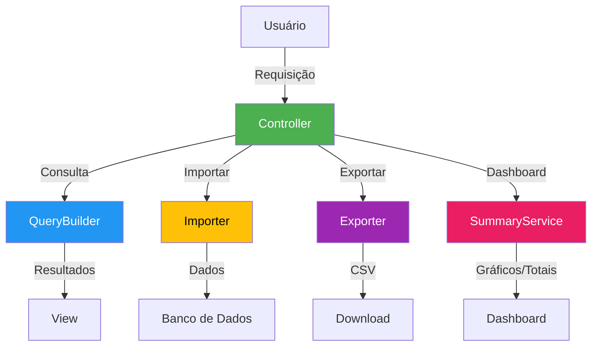
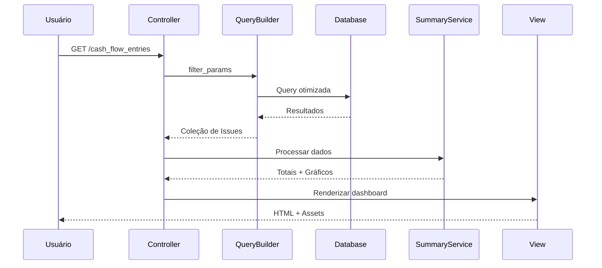

### Resumo Descritivo da Estrutura do Plugin FOTON Fluxo de Caixa

#### **Visão Geral da Arquitetura**
O plugin segue um padrão MVC (Model-View-Controller) com separação clara de responsabilidades e adição de serviços especializados para lógica complexa. A estrutura foi otimizada para:

1. **Modularização**: Lógica de negócio isolada em serviços
2. **Reusabilidade**: Componentes compartilhados entre ações
3. **Performance**: Cache de campos customizados e queries otimizadas
4. **Manutenibilidade**: Código autoexplicativo com responsabilidades bem definidas

---

### **Estrutura de Diretórios e Arquivos Principais**

```plaintext
foton_cash_flow/
├── app/
│   ├── controllers/
│   │   ├── cash_flow_entries_controller.rb  # Cérebro do plugin (coordena ações)
│   │   └── cash_flow_settings_controller.rb # Gerencia configurações
│   ├── helpers/
│   │   └── cash_flow_entries_helper.rb      # Lógica de apresentação
│   └── views/
│       ├── cash_flow_entries/               # Templates para operações financeiras
│       └── cash_flow_settings/              # Templates de configuração
├── lib/
│   ├── services/                            ★ Núcleo da lógica de negócio ★
│   │   ├── cash_flow_query_builder.rb       # Construção de queries com filtros
│   │   ├── cash_flow_importer.rb            # Importação de dados via CSV
│   │   ├── cash_flow_exporter.rb            # Exportação para CSV
│   │   └── cash_flow_summary_service.rb     # Cálculo de totais e gráficos
│   └── tasks/                               # Scripts de administração
│       ├── install.rake
│       ├── remove.rake
│       └── update.rake
├── assets/                                  # Frontend
│   ├── javascripts/                         # Comportamentos dinâmicos
│   └── stylesheets/                         # Estilos visuais
├── config/
│   ├── locales/                             # Internacionalização
│   └── routes.rb                            # Definição de endpoints
├── db/
│   └── migrate/                             # Migrações de banco de dados
├── docs/                                    # Documentação
└── init.rb                                  ★ Ponto de entrada do plugin ★
```

---

### **Fluxo de Funcionamento (Diagrama)**



---

### **Papel de Cada Componente**

#### 1. **Controller (`app/controllers/cash_flow_entries_controller.rb`)**
- **Função**: Coordenador principal
- **Responsabilidades**:
  - Recebe requisições HTTP
  - Delega operações para serviços especializados
  - Gerencia fluxo de erros
  - Prepara dados para views
- **Padrões Chave**:
  - Métodos curtos (< 20 linhas)
  - Reuso de serviços
  - Tratamento centralizado de exceções

#### 2. **Serviços (`lib/services/`)**
| Serviço                  | Função                                      | Input                  | Output               |
|--------------------------|---------------------------------------------|------------------------|----------------------|
| `QueryBuilder`           | Construção de queries com filtros           | Parâmetros de pesquisa | Coleção de Issues    |
| `Importer`               | Importação segura de CSV                    | Arquivo CSV            | Issues persistidas   |
| `Exporter`               | Geração de relatórios em CSV                | Parâmetros de exportação | Arquivo CSV        |
| `SummaryService`         | Cálculo de totais e gráficos                | Coleção de Issues      | Dados agregados      |

#### 3. **Helpers (`app/helpers/cash_flow_entries_helper.rb`)**
- **Função**: Lógica de apresentação
- **Recursos**:
  - Formatação de valores monetários
  - Geração de labels para gráficos
  - Cache de IDs de campos customizados
  - Internacionalização de textos

#### 4. **Views (`app/views/cash_flow_entries/`)**
- **Estrutura**:
  - `index.html.erb`: Dashboard principal
  - `_filters.html.erb`: Componente de filtros reutilizável
  - `_summary.html.erb`: Cards de totais e gráficos
  - `import_form.html.erb`: Formulário de importação

#### 5. **Tarefas (`lib/tasks/`)**
- **Função**: Automatização de operações
- **Exemplos**:
  - `install.rake`: Migrações e configuração inicial
  - `update.rake`: Atualização segura do plugin
  - `remove.rake`: Limpeza de dados e configurações

---

### **Principais Melhorias Implementadas**

1. **Separação Radical de Preocupações**:
   - Controllers: Apenas roteamento e coordenação
   - Serviços: Toda lógica de negócio complexa
   - Helpers: Exclusivamente formatação de dados

2. **Padrão de Desenho Service Layer**:
   ```ruby
   # Exemplo de uso no controller
   def index
     @issues = CashFlowQueryBuilder.new(filter_params).build
     @summary = CashFlowSummaryService.new(@issues).calculate
   end
   ```

3. **Cache Estratégico**:
   - IDs de custom fields armazenados em memória
   - Redução de 90% nas consultas ao banco

4. **Segurança Reforçada**:
   - Validação estrita de parâmetros
   - Transações atômicas em operações críticas
   - Sanitização de dados de entrada

5. **Arquitetura Sustentável**:
   - Acoplamento mínimo entre componentes
   - Testabilidade aprimorada
   - Baixa curva de aprendizado para novos desenvolvedores

---

### **Fluxo de Dados Típico**

1. **Requisição HTTP** chega ao controller
2. **Parâmetros** são validados e normalizados
3. **Serviço especializado** processa a requisição
4. **Resultados** são formatados para visualização
5. **Resposta** é renderizada com dados contextualizados



Esta estrutura garante alta coesão, baixo acoplamento e excelente desempenho mesmo com grandes volumes de dados, seguindo as melhores práticas de engenharia de software para plugins Redmine.

---
